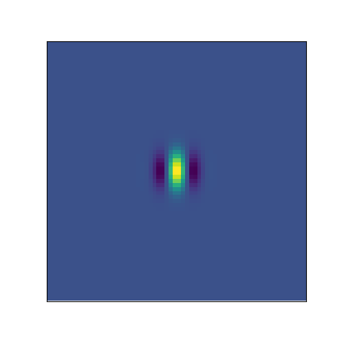
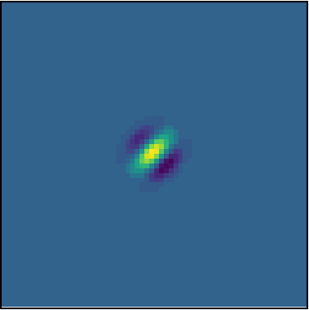
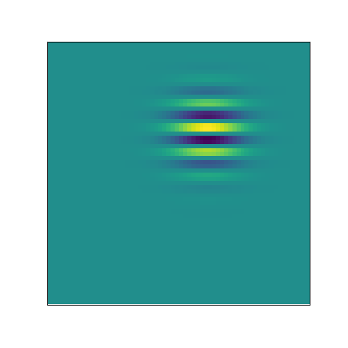
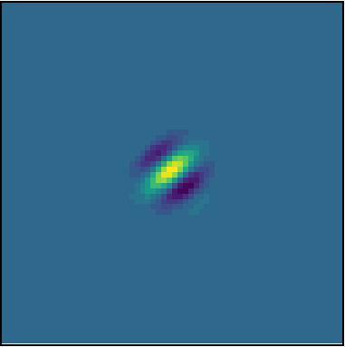
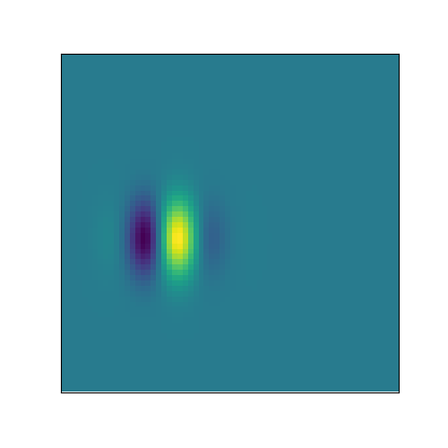
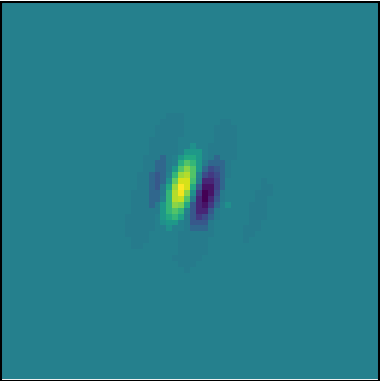
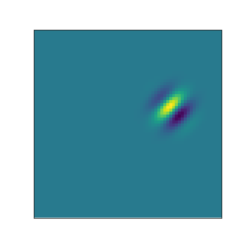
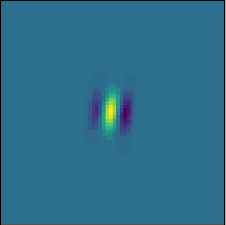

# Fit Gabor

If you have a neuron model and you want to find the gabor filter that maximizes the activity of your model neuron, this tool might come handy.

## Example

### 1. We need a neuron model

Let's create a simple linear-nonlinear neuron model with a known receptive field:
``` python
import torch
from torch import nn
from torch.nn import functional as F

class Neuron(nn.Module):
    def __init__(self, rf):
        super().__init__()
        self.rf = torch.tensor(rf.astype(np.float32))
        
    def forward(self, x):
        return F.elu((x * self.rf).sum()) + 1


from fitgabor.utils import gabor_fn

theta = -np.pi/4
groundtruth_rf = gabor_fn(theta, sigma=4, Lambda=14, psi=np.pi/2, gamma=1, center=(15, 5), size=(64, 64))
neuron = Neuron(groundtruth_rf)
```
Here is the **ground truth** RF:
<p align="center">
  
</p>

### 2. Initialize and train the gabor generator

``` python
from fitgabor import GaborGenerator, trainer_fn

gabor_gen = GaborGenerator(image_size=(64, 64))
gabor_gen, _ = trainer_fn(gabor_gen, neuron,
                          epochs=20000,
                          sigma_reg_lambda=7.25)
```

You can generate the learned gabor simply by calling the model:
``` python
learned_gabor = gabor_gen().data.numpy()
```

And here is the learning evolution:
<p align="center">
  
</p>

## Tried it and didn't work? 

Let me know, please! I would love to know why it did not work and help fix it :construction_worker:

<!-- ---
## More examples

Ground turth             |  Learned
:-------------------------:|:-------------------------:
  |  
  |  
  |  
  |   -->
